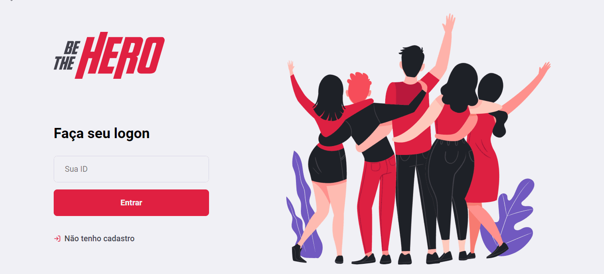

# Be The Hero

## Projeto Full Stack feito na Semana Omnistack 11 da Rocketseat

### Foram usadas as seguintes tecnologias:

> No backend
 - [Node.js](https://nodejs.org/pt-br/)
 - [Knex.js](http://knexjs.org/)
 - [Express](https://expressjs.com/pt-br/)
 - [SQLite3](https://www.sqlite.org/version3.html)

> No frontend WEB
 - [React.js](https://pt-br.reactjs.org/)
 - [Axios](https://github.com/axios/axios)

> No frontend MOBILE
 - [React Native](https://reactnative.dev/)
 - [React Navigation](https://reactnavigation.org/)
 - [Expo](https://expo.io/)
 - [Axios](https://github.com/axios/axios)